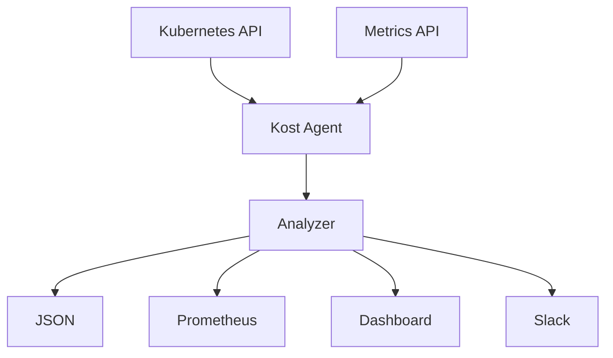

<div align="center">

<h1>Kost</h1>

</div>
Kubernetes clusters waste **30–50% of compute** from over-provisioning. Kost sits in your cluster, polls the Metrics API every 15 minutes, and tells you exactly what's wasting money — with the `kubectl` command to fix it.

---

## Overview

Kost is a single-pod Go agent built for teams that want to know where their Kubernetes spend is being wasted without installing a dashboard-first platform or handing usage data to a third party.

### Core design rules

- **Push over pull** — alerts come to you via Slack, you don't go check a dashboard.
- **Zero config to start** — every field has a default, the agent reports out of the box.
- **Every alert is actionable** — a finding without a fix command isn't useful.
- **Minimal footprint** — single pod, ~25MB image, no database.
- **Honest scope** — pricing is approximate and documented as such; it's a signal, not a source of truth.

---

## Why Kost?

| Feature | Kost | Typical Platforms |
|---------|:----:|:-----------------:|
| Zero config | ✅ | ⚠️ |
| Single pod | ✅ | ❌ |
| No database | ✅ | ❌ |
| Push-first alerts | ✅ | ⚠️ |
| Built-in dashboard | ✅ | ✅ |
| Ready-to-run fixes | ✅ | ⚠️ |

---
# Features

## Detection & Analysis

- Polls the Kubernetes Metrics API and pod specs on a configurable interval (default **15m**).
- Compares actual CPU/memory usage against each container's `resources.requests`.
- Flags workloads where the request exceeds actual usage by **1.5×** and estimated waste clears **$5/month**.
- Resolves the owner chain (**Pod → ReplicaSet → Deployment**) so fix commands target the correct resource.
- Generates right-sizing suggestions at **actual usage × 1.3**, with a **0.1 core / 0.1 GB** floor.

## Reporting & Observability

- JSON reports to stdout on every cycle.
- Prometheus metrics exposed on `/metrics`.
- Dark-themed HTML dashboard on `/dashboard`.
- In-memory rolling history of the last **200 reports** via `/api/reports`.
- Optional Slack alerts via webhook.

## Deployment & Operations

- Single replica Deployment.
- ~25MB image.
- Runs as non-root (UID 65534).
- Liveness and readiness probes.
- Graceful shutdown.
- Backup script for manifests, RBAC and metrics snapshot.

## Security & RBAC

- Read-only ClusterRole.
- No write access.
- No delete permissions.
- No pod exec.
- No secret reads.
- Read-only ConfigMap mount.

---

# Tech Stack

| Layer | Technologies |
|-------|--------------|
| Language | Go 1.22+ |
| K8s Client | client-go, apimachinery, Metrics API (dynamic client) |
| Metrics | Hand-written Prometheus text format |
| Dashboard | Embedded HTML/CSS/vanilla JS (`go:embed`) |
| Alerts | Slack Incoming Webhooks |
| Deployment | Kubernetes, Docker (multi-stage) |
| Code Quality | SonarCloud, go vet |

---

# Architecture Diagram




---

# Quick Start

## Clone the Repository

```bash
git clone https://github.com/nirjxr26/Kost.git
cd Kost
```

## Deploy to Kubernetes

```bash
# Create namespace
kubectl create ns kost

# Deploy resources
kubectl apply -f deploy/rbac.yaml \
  -f deploy/configmap.yaml \
  -f deploy/deployment.yaml \
  -f deploy/service.yaml
```

> Every flagged workload includes the exact `kubectl set resources` command—copy, paste, and apply. Zero configuration is required.

## Verify Deployment

```bash
kubectl logs -n kost deployment/kost --tail=20
```

Example output:

```json
{
  "cluster": "prod",
  "waste_monthly": 2847,
  "healthy": false,
  "findings": [
    {
      "workload": "auth-service",
      "namespace": "prod",
      "waste_monthly": 421,
      "fix": "kubectl set resources deployment/auth-service -n prod --requests=cpu=0.3,memory=1434Mi"
    }
  ]
}
```

## Access the UI

### Port Forward

```bash
kubectl port-forward -n kost deployment/kost 8080:8080
```

| Endpoint | URL |
| -------- | --- |
| Dashboard | http://localhost:8080/dashboard |
| Metrics | http://localhost:8080/metrics |
| Reports API | http://localhost:8080/api/reports |
| Health | http://localhost:8080/health |

## Local Development

```bash
go build -o kost ./cmd/kost/
go vet ./...
go test ./...

make image
make push
make deploy
```

## Optional: Slack Alerts

```bash
kubectl create secret generic kost-slack -n kost \
  --from-literal=SLACK_WEBHOOK_URL="https://hooks.slack.com/services/T00/B00/your-webhook"
```
---

# Project Structure

```text
├── cmd/
│   └── kost/
├── internal/
│   ├── config/
│   ├── k8s/
│   ├── analyze/
│   └── report/
├── deploy/
├── scripts/
│   └── backup.sh
```

## License

MIT

